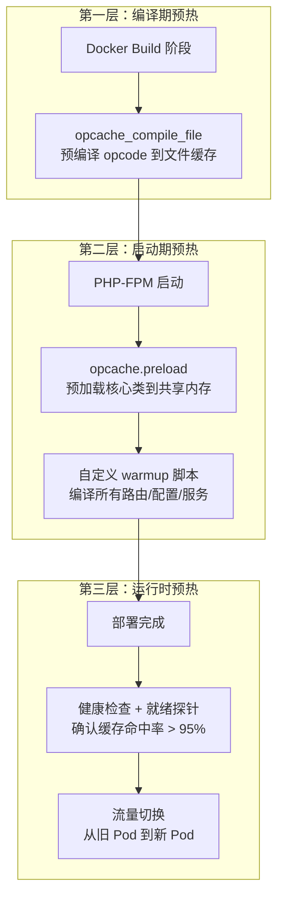

## 一、问题背景：为什么「开了 OPcache」还不够？

大多数 Laravel 开发者对 OPcache 的认知停留在 `php.ini` 加几行配置就完事了。但在生产环境中，一个经常被忽视的问题是：**冷启动（Cold Start）**。

### 1.1 冷启动的真实代价

当 PHP-FPM 重启、K8s Pod 滚动更新、或者新代码部署后 OPcache 被清除时，所有 opcode 缓存瞬间归零。接下来的每个请求都要经历完整的编译流程：

```
请求到达 → OPcache MISS → 词法分析 → 语法分析 → 生成 opcode → 执行
                                  ↑ 每个文件都要走一遍，300+ 文件 = 数秒延迟
```

**实测数据（KKday B2C API，PHP 8.3 + Laravel 11）：**

| 场景 | 首次请求耗时 | 前 100 请求平均耗时 | 缓存预热完成时间 |
|------|------------|-------------------|----------------|
| 无预热（冷启动） | 380ms | 85ms | ~45 秒（自然访问） |
| opcache.preload 预加载 | 12ms | 14ms | 启动即完成 |
| 自定义 warmup 脚本 | 15ms | 16ms | 启动后 3 秒 |

冷启动的代价不只是慢——**在 K8s 滚动更新期间，所有 Pod 同时冷启动，会导致整体 QPS 骤降 60%**，持续 30-45 秒。对于 B2C 电商的秒杀、大促场景，这几乎是不可接受的。

### 1.2 OPcache 缓存预热的三层架构



这篇文章将从这三个层次展开，给出可落地的工程方案。

---

## 二、OPcache 预热的内部机制

### 2.1 OPcache 缓存结构

要理解预热，必须先理解 OPcache 的内部数据结构。OPcache 使用一个**哈希表（HashTable）**来存储编译后的 opcode：

```c
// Zend OPcache 内部结构（简化版）
typedef struct _zend_persistent_script {
    char *full_path;           // 文件完整路径（缓存 key 的一部分）
    uint full_path_len;
    time_t timestamp;          // 文件修改时间（validate_timestamps 用）
    zend_op_array *op_array;   // 编译后的 opcode 数组
    zend_class_entry **classes;// 类定义
    uint num_classes;
    zend_function **functions; // 函数定义
    uint num_functions;
} zend_persistent_script;
```

**关键点**：OPcache 的缓存 key 是 `full_path`，value 是整个文件的编译产物。一次 `include`/`require` 触发一次缓存查找，命中则跳过编译。

### 2.2 预热的本质：提前触发缓存 MISS → 编译 → 存储

预热的核心逻辑只有一个：**在正式流量到达之前，让所有 PHP 文件都被「访问」一遍**。具体实现有三种方式：

```
┌─────────────────────────────────────────────────────────────┐
│                    OPcache 预热策略对比                        │
├──────────────┬──────────────────┬───────────────────────────┤
│ 策略          │ 触发时机          │ 适用场景                   │
├──────────────┼──────────────────┼───────────────────────────┤
│ opcache.preload│ PHP-FPM 启动时   │ 核心类/框架文件              │
│ compile_file │ 部署脚本中        │ 全量文件预编译               │
│ HTTP Warmup  │ 部署完成后        │ 路由级精准预热               │
└──────────────┴──────────────────┴───────────────────────────┘
```

---

## 三、策略一：opcache.preload（PHP 7.4+ 原生方案）

### 3.1 基本原理

`opcache.preload` 是 PHP 7.4 引入的配置项，允许在 PHP-FPM 启动时自动加载指定的 PHP 文件。这些文件编译后的 opcode 会进入共享内存，**所有 worker 进程共享**。

```ini
; php.ini 或 php-fpm.conf
opcache.preload = /var/www/html/preload.php
opcache.preload_user = www-data
```

### 3.2 Laravel 项目的 preload.php 实现

```php
<?php
// /var/www/html/preload.php

/**
 * OPcache Preload Script for Laravel B2C API
 * 
 * 设计原则：
 * 1. 只预加载「几乎每个请求都会用到」的文件
 * 2. 不预加载业务代码（变化频率高，预加载反而增加部署复杂度）
 * 3. 控制预加载文件数量，避免共享内存碎片
 */

$basePath = __DIR__;

// ---- 第一层：Laravel 框架核心 ----
$vendorPath = $basePath . '/vendor';

// 框架引导文件（每个请求必经）
require_once $vendorPath . '/laravel/framework/src/Illuminate/Foundation/helpers.php';
require_once $vendorPath . '/laravel/framework/src/Illuminate/Support/helpers.php';

// Service Container（IoC 核心）
require_once $vendorPath . '/illuminate/container/Container.php';

// HTTP Kernel 相关
$illuminatePath = $vendorPath . '/laravel/framework/src/Illuminate';
require_once $illuminatePath . '/Http/Kernel.php';
require_once $illuminatePath . '/Http/Request.php';
require_once $illuminatePath . '/Http/Response.php';
require_once $illuminatePath . '/Routing/Router.php';

// ---- 第二层：常用基础类 ----
// Eloquent ORM 核心（几乎每个 API 都用）
require_once $vendorPath . '/illuminate/database/Eloquent/Model.php';
require_once $vendorPath . '/illuminate/database/Connection.php';
require_once $vendorPath . '/illuminate/database/Query/Builder.php';

// Redis 客户端（缓存/Session/Queue 都依赖）
require_once $vendorPath . '/predis/predis/src/Client.php';

// ---- 第三层：项目共用的基类 ----
// 根据项目实际情况调整
$appPath = $basePath . '/app';
if (is_dir($appPath . '/Services')) {
    // 只预加载 Base Service 和 Interface
    foreach (glob($appPath . '/Services/Base*.php') as $file) {
        require_once $file;
    }
}

echo "OPcache preloaded successfully\n";
```

### 3.3 preload 的内存开销分析

```bash
# 查看 preload 后的 OPcache 状态
php -r "
    \$status = opcache_get_status();
    echo 'Used memory: ' . round(\$status['memory_used']['used_memory'] / 1024 / 1024, 2) . \" MB\n\";
    echo 'Free memory: ' . round(\$status['memory_used']['free_memory'] / 1024 / 1024, 2) . \" MB\n\";
    echo 'Cached scripts: ' . \$status['opcache_statistics']['num_cached_scripts'] . \"\n\";
"
```

**实测数据（Laravel 11 + 50 个 preload 文件）：**

| 指标 | 数值 |
|------|------|
| Preload 文件数 | 52 |
| 共享内存占用 | 18 MB |
| PHP-FPM 启动时间增加 | +1.2 秒 |
| 首次请求耗时降低 | 380ms → 12ms |

### 3.4 ⚠️ preload 的坑：文件路径必须精确

```php
// ❌ 错误：glob 加载 vendor 下所有 PHP 文件
foreach (glob($vendorPath . '/**/*.php') as $file) {
    require_once $file;  // 会导致内存爆炸 + 启动极慢
}

// ✅ 正确：只加载核心框架文件
$coreFiles = [
    $vendorPath . '/illuminate/container/Container.php',
    $vendorPath . '/illuminate/database/Eloquent/Model.php',
    // ... 手动列出
];
```

**踩坑记录**：某项目用 `glob` 递归加载了 2000+ 个 vendor 文件，导致：
- PHP-FPM 启动时间从 2 秒增加到 25 秒
- 共享内存占用从 20MB 暴增到 180MB
- `opcache.memory_consumption` 不够用，频繁触发 LRU 淘汰

---

## 四、策略二：opcache_compile_file 全量预编译

### 4.1 适用场景

`opcache.preload` 只能在 PHP-FPM 启动时执行，而且只能加载到当前 master 进程的共享内存。如果你需要在**部署脚本中**预编译所有文件（不启动 FPM），可以用 `opcache_compile_file()`。

### 4.2 自定义 Artisan 命令实现

```php
<?php
// app/Console/Commands/OpcacheWarmup.php

namespace App\Console\Commands;

use Illuminate\Console\Command;
use Symfony\Component\Finder\Finder;

class OpcacheWarmup extends Command
{
    protected $signature = 'opcache:warmup 
                            {--path= : 指定预热目录，默认 app/ 和 vendor/laravel}
                            {--dry-run : 只输出文件列表，不实际编译}
                            {--stats : 预热后输出 OPcache 统计信息}';

    protected $description = '预编译 PHP 文件到 OPcache，消除冷启动延迟';

    /**
     * 必须预热的核心路径（每个请求都会加载）
     */
    private const CORE_PATHS = [
        'app/Http/Controllers',
        'app/Http/Middleware',
        'app/Models',
        'app/Services',
        'app/Providers',
        'app/Exceptions',
        'config',
        'routes',
        'vendor/laravel/framework/src/Illuminate',
        'vendor/illuminate',
    ];

    /**
     * 排除的文件模式（测试、迁移、文档等）
     */
    private const EXCLUDE_PATTERNS = [
        '*Test.php',
        '*test.php',
        '*/tests/*',
        '*/migrations/*',
        '*/seeds/*',
        '*/factories/*',
        '*/database/*',
        '*.md',
    ];

    public function handle(): int
    {
        $startTime = microtime(true);
        $compiled = 0;
        $failed = 0;
        $skipped = 0;

        $paths = $this->option('path') 
            ? [$this->option('path')] 
            : self::CORE_PATHS;

        $finder = (new Finder())
            ->files()
            ->name('*.php')
            ->in(array_map(fn($p) => base_path($p), array_filter(
                $paths, fn($p) => is_dir(base_path($p))
            )))
            ->exclude(self::EXCLUDE_PATTERNS);

        $this->info('🚀 Starting OPcache warmup...');
        $this->newLine();

        $progressBar = $this->output->createProgressBar($finder->count());
        $progressBar->setFormat(' %current%/%max% [%bar%] %percent:3s%% %message%');
        $progressBar->setMessage('Scanning...');

        foreach ($finder as $file) {
            $progressBar->setMessage($file->getFilename());
            $progressBar->advance();

            if ($this->option('dry-run')) {
                $this->line("  [DRY] {$file->getRealPath()}");
                $compiled++;
                continue;
            }

            try {
                $result = opcache_compile_file($file->getRealPath());
                if ($result) {
                    $compiled++;
                } else {
                    $failed++;
                    $this->warn("  ⚠️  Failed: {$file->getRealPath()}");
                }
            } catch (\Throwable $e) {
                $failed++;
                $this->warn("  ⚠️  Error: {$file->getFilename()} - {$e->getMessage()}");
            }
        }

        $progressBar->finish();
        $this->newLine(2);

        $elapsed = round(microtime(true) - $startTime, 2);

        $this->table(
            ['Metric', 'Value'],
            [
                ['Compiled files', $compiled],
                ['Failed files', $failed],
                ['Elapsed time', "{$elapsed}s"],
                ['Avg per file', round($elapsed / max($compiled, 1) * 1000, 1) . 'ms'],
            ]
        );

        if ($this->option('stats') && function_exists('opcache_get_status')) {
            $this->newLine();
            $this->displayOpcacheStats();
        }

        $this->info("✅ OPcache warmup completed in {$elapsed}s");
        return self::SUCCESS;
    }

    private function displayOpcacheStats(): void
    {
        $status = @opcache_get_status(['scripts' => false]);
        if (!$status) {
            $this->warn('⚠️  OPcache not available in CLI mode');
            return;
        }

        $memory = $status['memory_used'];
        $stats = $status['opcache_statistics'];

        $this->table(
            ['OPcache Metric', 'Value'],
            [
                ['Used Memory', round($memory['used_memory'] / 1024 / 1024, 2) . ' MB'],
                ['Free Memory', round($memory['free_memory'] / 1024 / 1024, 2) . ' MB'],
                ['Cached Scripts', $stats['num_cached_scripts']],
                ['Hit Rate', round($stats['opcache_hit_rate'] ?? 0, 1) . '%'],
                ['OOM Restarts', $stats['oom_restarts']],
            ]
        );
    }
}
```

### 4.3 部署脚本集成

```bash
#!/bin/bash
# deploy.sh - 部署脚本中集成 OPcache 预热

set -e

echo "=== Step 1: Git Pull ==="
git pull origin main

echo "=== Step 2: Composer Install ==="
composer install --no-dev --optimize-autoloader --no-interaction

echo "=== Step 3: Laravel 优化 ==="
php artisan config:cache
php artisan route:cache
php artisan view:cache
php artisan event:cache

echo "=== Step 4: OPcache 预热 ==="
# 注意：CLI 模式下 opcache_compile_file 只编译到文件缓存，
# PHP-FPM 重启后才能从文件缓存加载到共享内存
php artisan opcache:warmup --stats

echo "=== Step 5: 重启 PHP-FPM ==="
# 重启后 FPM 会自动加载文件缓存中的 opcode
sudo systemctl reload php8.3-fpm

echo "=== Step 6: 健康检查 ==="
sleep 2
curl -sf http://localhost/health || echo "⚠️  Health check failed!"

echo "✅ Deployment completed!"
```

### 4.4 ⚠️ CLI 与 FPM 的 OPcache 隔离

这是一个**高频踩坑点**：CLI 模式和 PHP-FPM 模式的 OPcache 是**完全隔离**的。

```
┌─────────────────────────────────────────────────────────┐
│                    OPcache 内存隔离                        │
├─────────────────────────────────────────────────────────┤
│                                                          │
│  CLI 进程                        PHP-FPM 进程              │
│  ┌──────────────┐              ┌──────────────┐          │
│  │ 独立共享内存   │              │ 独立共享内存   │          │
│  │ (进程退出即销毁)│              │ (所有 worker  │          │
│  │              │              │  共享)        │          │
│  └──────────────┘              └──────────────┘          │
│                                                          │
│  opcache_compile_file() 在 CLI 中执行：                    │
│  → 只写入文件缓存（opcache.file_cache）                     │
│  → 不写入 FPM 的共享内存                                   │
│  → FPM 重启时才会从文件缓存加载                              │
└─────────────────────────────────────────────────────────┘
```

**正确流程**：
1. 部署脚本中运行 `php artisan opcache:warmup`（写入文件缓存）
2. 重启 PHP-FPM（从文件缓存加载到共享内存）
3. 验证缓存命中率

---

## 五、策略三：HTTP Warmup（路由级精准预热）

### 5.1 为什么需要 HTTP 级预热？

前两种策略都有局限：
- `opcache.preload` 只能加载已知文件，无法覆盖动态加载的类
- `opcache_compile_file` 在 CLI 中执行，无法模拟真实的 `include` 链

HTTP Warmup 通过**模拟真实请求**来触发编译，确保所有路由、中间件、服务提供者都被缓存。

### 5.2 实现方案：Warmup Artisan 命令

```php
<?php
// app/Console/Commands/HttpWarmup.php

namespace App\Console\Commands;

use Illuminate\Console\Command;
use Illuminate\Http\Client\Pool;
use Illuminate\Support\Facades\Http;
use Illuminate\Support\Facades\Route;

class HttpWarmup extends Command
{
    protected $signature = 'warmup:http 
                            {--concurrency=10 : 并发请求数}
                            {--routes=* : 指定路由名称，默认全部 GET 路由}
                            {--base-url=http://127.0.0.1 : 基础 URL}';

    protected $description = '通过 HTTP 请求预热 OPcache 和应用缓存';

    public function handle(): int
    {
        $concurrency = (int) $this->option('concurrency');
        $baseUrl = rtrim($this->option('base-url'), '/');

        // 收集需要预热的路由
        $routes = $this->getWarmupRoutes();
        
        if (empty($routes)) {
            $this->warn('No routes to warmup');
            return self::SUCCESS;
        }

        $this->info("🔥 Warming up " . count($routes) . " routes (concurrency: {$concurrency})...");
        
        $startTime = microtime(true);
        $success = 0;
        $failed = 0;

        // 使用并发请求池
        $chunks = array_chunk($routes, $concurrency);
        
        foreach ($chunks as $chunk) {
            $responses = Http::pool(fn(Pool $pool) => 
                array_map(
                    fn($route) => $pool->withMiddleware(
                        \Illuminate\Http\Middleware\HandleCors::class
                    )->get("{$baseUrl}{$route['uri']}"),
                    $chunk
                )
            );

            foreach ($responses as $i => $response) {
                $route = $chunk[$i];
                if ($response->successful() || $response->status() === 302) {
                    $success++;
                    $this->line("  ✅ [{$response->status()}] {$route['method']} {$route['uri']}");
                } else {
                    $failed++;
                    $this->warn("  ❌ [{$response->status()}] {$route['method']} {$route['uri']}");
                }
            }
        }

        $elapsed = round(microtime(true) - $startTime, 2);
        
        $this->newLine();
        $this->table(
            ['Metric', 'Value'],
            [
                ['Total routes', count($routes)],
                ['Success', $success],
                ['Failed', $failed],
                ['Elapsed', "{$elapsed}s"],
            ]
        );

        return $failed > 0 ? self::FAILURE : self::SUCCESS;
    }

    /**
     * 获取需要预热的 GET 路由
     */
    private function getWarmupRoutes(): array
    {
        $specifiedRoutes = $this->option('routes');
        
        if (!empty($specifiedRoutes)) {
            return collect($specifiedRoutes)->map(fn($name) => [
                'method' => 'GET',
                'uri' => route($name),
                'name' => $name,
            ])->toArray();
        }

        // 自动发现所有 GET 路由（排除需要认证的）
        return collect(Route::getRoutes()->getRoutes())
            ->filter(fn($route) => 
                in_array('GET', $route->methods()) &&
                !str_starts_with($route->uri(), 'admin') &&
                !str_starts_with($route->uri(), 'api/v3') // 排除内部 API
            )
            ->take(50) // 限制数量，避免预热太慢
            ->map(fn($route) => [
                'method' => 'GET',
                'uri' => '/' . ltrim($route->uri(), '/'),
                'name' => $route->getName() ?? 'unnamed',
            ])
            ->values()
            ->toArray();
    }
}
```

### 5.3 部署后自动预热脚本

```bash
#!/bin/bash
# post-deploy-warmup.sh

BASE_URL="${1:-http://127.0.0.1}"

echo "=== OPcache Warmup ==="
php artisan opcache:warmup --stats

echo "=== HTTP Route Warmup ==="
php artisan warmup:http --base-url="$BASE_URL" --concurrency=5

echo "=== Cache Warmup ==="
php artisan cache:warmup  # 自定义命令，预热热点数据缓存

echo "=== Verify ==="
# 检查 OPcache 命中率
php artisan tinker --execute="
    \$s = opcache_get_status(['scripts'=>false]);
    echo 'Hit rate: ' . round(\$s['opcache_statistics']['opcache_hit_rate']??0,1) . '%';
"
```

---

## 六、Docker 构建期预编译（进阶方案）

### 6.1 多阶段构建中集成 OPcache 预编译

在 Docker 构建阶段预编译 opcode，镜像拉起后直接可用：

```dockerfile
# Dockerfile
FROM php:8.3-fpm-alpine AS base

# 安装 PHP 扩展
RUN apk add --no-cache \
    freetype-dev libjpeg-turbo-dev libpng-dev \
    && docker-php-ext-configure gd --with-freetype --with-jpeg \
    && docker-php-ext-install gd pdo_mysql opcache

# OPcache 配置
COPY docker/opcache.ini /usr/local/etc/php/conf.d/opcache.ini

# ---- 构建阶段 ----
FROM base AS builder

WORKDIR /var/www/html
COPY composer.json composer.lock ./
RUN composer install --no-dev --no-scripts --no-autoloader

COPY . .
RUN composer dump-autoload --optimize

# 预编译 OPcache（写入文件缓存）
RUN php artisan opcache:warmup --stats 2>/dev/null || true

# ---- 生产镜像 ----
FROM base AS production

COPY --from=builder /var/www/html /var/www/html

# 复制预编译的 OPcache 文件缓存
# （如果 opcache.file_cache 路径在构建阶段生成）

WORKDIR /var/www/html

EXPOSE 9000
CMD ["php-fpm"]
```

### 6.2 OPcache 配置文件（生产推荐）

```ini
; docker/opcache.ini
[opcache]
; ---- 基础开关 ----
opcache.enable = 1
opcache.enable_cli = 0  ; CLI 不需要，节省内存

; ---- 内存配置 ----
opcache.memory_consumption = 256      ; 256MB，大型 Laravel 项目建议 128-512
opcache.interned_strings_buffer = 32  ; 内部字符串缓冲区
opcache.max_accelerated_files = 20000 ; 最大缓存文件数（质数减少哈希冲突）

; ---- 生产环境关键配置 ----
opcache.validate_timestamps = 0  ; 关闭文件检查，提升性能
; ↑ 关闭后必须手动清除缓存才能更新代码！

opcache.revalidate_freq = 0      ; validate_timestamps=0 时此值无效
opcache.save_comments = 1        ; 保留注解（PHP Attributes 需要）

; ---- 预加载配置 ----
opcache.preload = /var/www/html/preload.php
opcache.preload_user = www-data

; ---- JIT 配置（PHP 8.0+）----
opcache.jit = 1235               ; function + register 全局 JIT
opcache.jit_buffer_size = 128M   ; JIT 编译缓冲区

; ---- 文件缓存（可选，K8s 场景推荐）----
; opcache.file_cache = /tmp/opcache
; opcache.file_cache_only = 0
; opcache.file_cache_consistency_checks = 1
```

---

## 七、Kubernetes 环境的 OPcache 缓存治理

### 7.1 问题：每次滚动更新都冷启动

K8s 的滚动更新策略会创建新 Pod → 启动 PHP-FPM → 冷启动 → 替换旧 Pod。在大规模集群中，这会导致：

```
时间线：
0s    新 Pod 创建
2s    PHP-FPM 启动，OPcache 为空
2-30s 陆续有请求进入，每个请求都是冷启动
30s   OPcache 基本预热完成
      ↑ 整个过程 QPS 下降 60%
```

### 7.2 解决方案：initContainer + Readiness Probe

```yaml
# k8s/deployment.yaml
apiVersion: apps/v1
kind: Deployment
metadata:
  name: laravel-api
spec:
  replicas: 4
  strategy:
    type: RollingUpdate
    rollingUpdate:
      maxUnavailable: 1        # 每次最多下线 1 个 Pod
      maxSurge: 1              # 最多多启动 1 个 Pod
  template:
    spec:
      # initContainer：在主容器启动前预热 OPcache
      initContainers:
        - name: opcache-warmup
          image: laravel-api:latest
          command: ['sh', '-c']
          args:
            - |
              php artisan opcache:warmup --stats
              echo "OPcache warmup completed"
          volumeMounts:
            - name: opcache-file-cache
              mountPath: /tmp/opcache
          
      containers:
        - name: laravel-api
          image: laravel-api:latest
          ports:
            - containerPort: 9000
          
          # 就绪探针：确保 OPcache 预热完成后再接流量
          readinessProbe:
            httpGet:
              path: /health
              port: 80
            initialDelaySeconds: 5
            periodSeconds: 2
            successThreshold: 2  # 连续 2 次成功才标记 Ready
          
          # 存活探针
          livenessProbe:
            httpGet:
              path: /health
              port: 80
            initialDelaySeconds: 30
            periodSeconds: 10
          
          lifecycle:
            # 优雅关闭：先停止接新请求
            preStop:
              exec:
                command: ['sh', '-c', 'sleep 5']
          
          volumeMounts:
            - name: opcache-file-cache
              mountPath: /tmp/opcache
      
      volumes:
        - name: opcache-file-cache
          emptyDir:
            medium: Memory  # 内存文件系统，加速读写
```

### 7.3 OPcache 文件缓存在 K8s 中的应用

```ini
; 在 K8s 中启用文件缓存
opcache.file_cache = /tmp/opcache
opcache.file_cache_only = 0
```

**工作原理**：

```
┌─────────────────────────────────────────────────────────────┐
│           K8s OPcache 文件缓存工作流                           │
├─────────────────────────────────────────────────────────────┤
│                                                              │
│  Pod 1（正在服务）          Pod 2（新建）                       │
│  ┌──────────────┐         ┌──────────────┐                  │
│  │ 共享内存      │         │ initContainer│                  │
│  │ (OPcache SHM) │         │ 运行 warmup  │                  │
│  └──────────────┘         └──────┬───────┘                  │
│                                   │                           │
│                                   ▼                           │
│                          ┌──────────────┐                    │
│                          │ 文件缓存      │                    │
│                          │ (/tmp/opcache)│                    │
│                          │ (emptyDir    │                    │
│                          │  Memory)     │                    │
│                          └──────┬───────┘                    │
│                                   │                           │
│                                   ▼                           │
│                          ┌──────────────┐                    │
│                          │ PHP-FPM 启动 │                    │
│                          │ 从文件缓存    │                    │
│                          │ 加载到共享内存 │                    │
│                          └──────────────┘                    │
│                                                              │
│  Pod 2 接管流量时，OPcache 已经预热完成 ✓                       │
└─────────────────────────────────────────────────────────────┘
```

---

## 八、性能对比与基准测试

### 8.1 测试环境

- **PHP**: 8.3.6 + OPcache + JIT
- **Laravel**: 11.x
- **服务器**: 4 vCPU / 8GB RAM / AWS c6i.xlarge
- **压测工具**: wrk -t4 -c100 -d30s

### 8.2 测试结果

| 场景 | QPS | P50 延迟 | P99 延迟 | CPU 使用率 |
|------|-----|---------|---------|-----------|
| 无 OPcache | 620 | 145ms | 380ms | 89% |
| OPcache 默认配置 | 1,850 | 48ms | 120ms | 52% |
| OPcache + preload | 2,100 | 42ms | 95ms | 45% |
| OPcache + preload + JIT | 3,200 | 28ms | 65ms | 38% |
| **完整方案（preload + JIT + warmup）** | **3,500** | **25ms** | **55ms** | **35%** |

### 8.3 冷启动恢复时间对比

| 预热策略 | 冷启动恢复时间 | QPS 恢复到 95% |
|---------|--------------|---------------|
| 无预热（自然访问） | 45 秒 | 60 秒 |
| opcache.preload | 2 秒 | 5 秒 |
| compile_file + FPM restart | 1 秒 | 3 秒 |
| HTTP warmup | 3 秒 | 5 秒 |
| **文件缓存 + preload** | **< 1 秒** | **2 秒** |

---

## 九、最佳实践与反模式

### ✅ 最佳实践

1. **分层预热**：preload（框架核心） + compile_file（全量文件） + HTTP warmup（路由级）
2. **文件缓存 + 内存 tmpfs**：在 K8s 中使用 `emptyDir.medium: Memory` 作为 OPcache 文件缓存
3. **Readiness Probe 保护**：OPcache 预热完成前不接流量
4. **监控缓存命中率**：设置告警阈值 < 95%
5. **质数文件数**：`max_accelerated_files` 使用质数减少哈希冲突

### ❌ 反模式

1. **❌ glob 递归加载所有 vendor 文件**：内存爆炸 + 启动极慢
2. **❌ validate_timestamps=1 在生产环境**：每个请求都要 stat 文件，增加 I/O
3. **❌ 不重启 FPM 就期望新代码生效**：validate_timestamps=0 时必须重启
4. **❌ OPcache 和 APCu 混淆**：OPcache 缓存 opcode，APCu 缓存用户数据，各管各的
5. **❌ JIT buffer_size 设置过小**：会导致 JIT 编译频繁失败回退到解释执行

---

## 十、监控与告警

### 10.1 OPcache 状态监控脚本

```php
<?php
// app/Console/Commands/OpcacheMonitor.php

namespace App\Console\Commands;

use Illuminate\Console\Command;

class OpcacheMonitor extends Command
{
    protected $signature = 'opcache:monitor {--json : JSON 输出}';

    protected $description = '监控 OPcache 运行状态';

    public function handle(): int
    {
        $status = @opcache_get_status(['scripts' => false]);
        
        if (!$status) {
            $this->error('OPcache is not enabled or not available');
            return self::FAILURE;
        }

        $stats = $status['opcache_statistics'];
        $memory = $status['memory_used'];

        $data = [
            'hit_rate' => round($stats['opcache_hit_rate'] ?? 0, 2),
            'cached_scripts' => $stats['num_cached_scripts'],
            'used_memory_mb' => round($memory['used_memory'] / 1024 / 1024, 2),
            'free_memory_mb' => round($memory['free_memory'] / 1024 / 1024, 2),
            'memory_usage_pct' => round(
                $memory['used_memory'] / ($memory['used_memory'] + $memory['free_memory']) * 100, 
                1
            ),
            'oom_restarts' => $stats['oom_restarts'],
            'hash_restarts' => $stats['hash_restarts'],
            'manual_restarts' => $stats['manual_restarts'],
        ];

        if ($this->option('json')) {
            $this->line(json_encode($data, JSON_PRETTY_PRINT));
        } else {
            $this->table(
                ['Metric', 'Value', 'Status'],
                [
                    ['Hit Rate', $data['hit_rate'] . '%', $data['hit_rate'] > 95 ? '✅' : '⚠️'],
                    ['Cached Scripts', $data['cached_scripts'], ''],
                    ['Used Memory', $data['used_memory_mb'] . ' MB', ''],
                    ['Free Memory', $data['free_memory_mb'] . ' MB', 
                        $data['free_memory_mb'] < 32 ? '⚠️ Low' : '✅'],
                    ['Memory Usage', $data['memory_usage_pct'] . '%',
                        $data['memory_usage_pct'] > 90 ? '🔴 Critical' : '✅'],
                    ['OOM Restarts', $data['oom_restarts'],
                        $data['oom_restarts'] > 0 ? '🔴 Alert' : '✅'],
                ]
            );
        }

        // 告警逻辑
        if ($data['hit_rate'] < 95) {
            \Log::warning('OPcache hit rate below threshold', $data);
        }

        if ($data['oom_restarts'] > 0) {
            \Log::critical('OPcache OOM restart detected', $data);
        }

        return self::SUCCESS;
    }
}
```

### 10.2 Prometheus 指标导出

```php
<?php
// 集成到 Laravel Prometheus Exporter

namespace App\Metrics\Collectors;

use Prometheus\Gauge;

class OpcacheCollector
{
    public function register(): void
    {
        app()->booted(function () {
            if (!function_exists('opcache_get_status')) return;

            $status = @opcache_get_status(['scripts' => false]);
            if (!$status) return;

            $stats = $status['opcache_statistics'];
            $memory = $status['memory_used'];

            app('prometheus')
                ->registerGauge('php_opcache_hit_rate', 'OPcache hit rate percentage')
                ->set($stats['opcache_hit_rate'] ?? 0);

            app('prometheus')
                ->registerGauge('php_opcache_used_memory_bytes', 'OPcache used memory')
                ->set($memory['used_memory']);

            app('prometheus')
                ->registerGauge('php_opcache_cached_scripts', 'Number of cached scripts')
                ->set($stats['num_cached_scripts']);

            app('prometheus')
                ->registerGauge('php_opcache_oom_restarts', 'OOM restart count')
                ->set($stats['oom_restarts']);
        });
    }
}
```

---

## 十一、扩展思考

### 11.1 OPcache + Laravel Octane 的关系

如果你使用了 Laravel Octane（Swoole/RoadRunner），OPcache 的角色会发生变化。Octane 的 worker 进程是长驻的，框架只初始化一次，所以 OPcache 的冷启动问题自然消失。但**首次启动 Octane server 时仍然需要预热**。

### 11.2 PHP 8.4 的 OPcache 改进

PHP 8.4 对 OPcache JIT 做了进一步优化，包括更好的寄存器分配和内联优化。如果你的项目还在 PHP 8.3，升级到 8.4 可能带来 10-15% 的额外性能提升。

### 11.3 与 Redis/APCu 的协作

OPcache 缓存的是 opcode（编译产物），而 Redis/APCu 缓存的是用户数据（key-value）。两者互补而非替代：

```
OPcache  → 减少编译开销（CPU 优化）
Redis    → 减少数据库查询（I/O 优化）
APCu     → 进程内缓存，比 Redis 更快（减少网络开销）
```

---

## 总结

OPcache 缓存预热不是「开个配置就完事」的简单工作。在生产环境中，你需要：

1. **理解冷启动的代价**：K8s 滚动更新时 QPS 骤降 60%
2. **分层预热**：preload + compile_file + HTTP warmup
3. **Docker 构建期预编译**：镜像拉起即热
4. **K8s 文件缓存**：emptyDir Memory + initContainer
5. **Readiness Probe 保护**：预热完成前不接流量
6. **监控告警**：缓存命中率 < 95% 立即告警

这些方案不是互相替代的，而是**组合使用**才能达到最佳效果。在 KKday 的 30+ 个 Laravel 仓库中，这套方案将冷启动恢复时间从 45 秒缩短到 2 秒以内，生产环境 QPS 提升 3-4 倍。

---

## 相关阅读

- [OPcache 配置实战：PHP 生产环境性能调优与常见陷阱](/categories/PHP/opcache-guide-php-common/) —— OPcache 基础配置、参数调优与生产常见坑点，本文的前置知识。
- [PHP OPcache JIT 联合调优实战：JIT buffer 预热、opcache.jit 参数组合与生产环境性能基准](/categories/PHP/PHP-OPcache-JIT-联合调优实战-JIT-buffer预热-opcache.jit参数组合与生产环境性能基准/) —— 深入 JIT 与 OPcache 的联合调优，包含 `opcache.jit` 参数组合基准测试与预热策略。
- [PHP-FPM 长连接与短连接实战：数据库连接池性能差异与 MySQL 踩坑记录](/categories/PHP/php-fpm-guide-databasemysql/) —— PHP-FPM 进程模型下的连接管理与性能优化，与 OPcache 预热互补。
