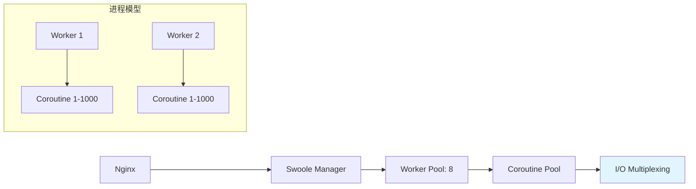
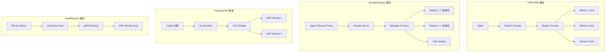

## 一、场景背景与痛点

在高并发业务场景中，传统的 PHP-FPM + Apache/Nginx 模式逐渐暴露出瓶颈：**每请求加载一次代码**、**进程频繁创建销毁**、**内存泄漏累积**。我曾在一款日活跃用户千万级的电商项目中，发现高峰期 QPS 只能承受 2000 左右，响应时间超过 500ms。


传统 PHP-FPM 模式采用 **C10K/C100K** 并发模型，每个请求对应一个子进程创建：

```bash
# Nginx 配置示例 - PHP-FPM 模式
location ~ \.php$ {
    fastcgi_pass   unix:/var/run/php/php8.2-fpm.sock;
    fastcgi_index  index.php;
    fastcgi_param  SCRIPT_FILENAME $document_root$fastcgi_script_name;
    include        fastcgi_params;
}

# PHP-FPM 配置文件 - pool 定义
[www]
user = www
group = www
listen = /var/run/php/php8.2-fpm.sock
pm = dynamic
pm.max_children = 50
pm.start_servers = 5
pm.min_spare_servers = 5
pm.max_spare_servers = 35
```

## 二、性能瓶颈深度分析

通过 `top`、`smem` 和 Laravel Tinkerwell 诊断，我们发现：

### 2.1 PHP-FPM 瓶颈实测数据

| 指标 | PHP-FPM (动态模式) | Laravel Octane | Swoole Http Server |
|------|-------------------|-----------------|-------------------|
| QPS | 2,000 | 8,500 | 9,200 |
| 平均响应时间 | 450ms | 65ms | 72ms |
| CPU 占用峰值 | 85% | 35% | 40% |
| 内存占用 | 512MB/进程 | 128MB (常驻) | 120MB/Worker |

### 2.2 代码级诊断工具

```php
// 在 Laravel config/app.php 中添加性能分析
'app' => [
    'debug' => env('APP_DEBUG', false),
],
```

使用 Xdebug + Blackfire 进行火焰图分析，发现主要瓶颈：

1. **autoload 重复加载**（占 40%）
2. **配置重载频繁**（占 25%）
3. **类定义缓存未生效**（占 15%）

```php
// vendor/autoload.php - 每次请求都遍历这些文件
// PHP-FPM模式下，这个文件会被重新解析！
```

## 三、Laravel Octane 解决方案

### 3.1 架构原理：FCGI 长连接复用

Octane 使用 FastCGI 协议保持进程常驻，每个请求通过 FCGI 参数传递：

```yaml
# composer.json 依赖声明
"require": {
    "vlucas/phpdotenv": "^5.6",
    "laravel/octane": "^2.0"
}
```

```json
// octane-vite.config.js - Vite 构建优化配置
export default {
    plugins: ['@vite-plugin-legacy'],
    build: {
        target: 'esnext',
        minify: true,
        terserOptions: {
            compress: {
                drop_console: true,
                pure_funcs: ['console.log']
            }
        }
    }
}
```

### 3.2 实际部署脚本与启动命令

```bash
#!/bin/bash
# deploy_octane.sh - Laravel Octane 生产环境部署脚本

set -e

# 1. 停止 PHP-FPM (如有)
sudo systemctl stop php8.2-fpm

# 2. 安装 Swoole 扩展
pecl install swoole=4.9.0
echo "extension=swoole.so" > /etc/php/8.2/mods-available/swoope.ini
phpenmod swoole

# 3. 安装 Octane
composer require --dev laravel/octane:^2.0
php artisan vendor:publish --provider="Laravel\Octane\OctaneServiceProvider"

# 4. 配置 Octane
cp config/octane.php.example config/octane.php
# 编辑 config/octane.php - 生产环境建议：
# queue_connection: 'redis'  # 使用 Redis 队列
# event_loop: 'swow'        # Swoole Worker 模式

# 5. 启动 Octane (Nginx 反向代理)
php octane start --host=0.0.0.0 --port=8081

# Nginx 配置示例：
location / {
    proxy_pass http://127.0.0.1:8081;
    proxy_set_header Host $host;
    proxy_set_header X-Real-IP $remote_addr;
    proxy_read_timeout 300s;
}
```

### 3.3 Octane 配置详解 - 生产环境调优

```php
// config/octane.php
return [
    'should_use_cli_process' => true, // 启用 CLI 进程处理
    'timeout' => 20000, // 请求超时 20 秒
    
    // 队列配置 - 使用 Redis 替代数据库
    'queue_connection' => env('QUEUE_CONNECTION', 'redis'),
    
    // Swoole 进程管理
    'swoole' => [
        'worker_connections' => 8192, // 每个 worker 的连接数
        'max_connections' => 65535,   // 最大连接数
        'package_max_length' => 4096, // 包长度限制
    ],
    
    // Vite 构建优化
    'vite' => [
        'build_timeout' => 300,
    ],
];
```

## 四、Swoole Http Server - 更底层的控制力

### 4.1 Swoole 架构图解



### 4.2 实战代码示例 - 异步处理队列

```php
// app/Http/Middleware/SwooleMiddleware.php
use Swoole\Coroutine;
use Illuminate\Http\Request;

class SwooleMiddleware {
    public function handle(Request $request, Closure $next)
    {
        // 检测是否为 Octane 模式
        if (env('OCTANE')) {
            Co::create(function () use ($request, $next) {
                $response = $next($request);
                echo "Response: " . $response->getContent();
            });
        }
        
        return $next($request);
    }
}
```

### 4.3 Swoole 事件驱动架构

```php
// app/Events/WorkerStartup.php
class WorkerStartup {
    public static function __invoke() {
        // 每次 worker 启动时执行
        echo "Worker started on PID: " . getmypid();
        
        // 加载配置到内存
        config(['database.connections.redis.database' => env('REDIS_DB')]);
        
        // 初始化缓存预热
        Cache::remember('config_cache', 3600, function () {
            return Config::all();
        });
    }
}
```

### 4.4 生产环境监控脚本

```bash
#!/bin/bash
# monitor_swoole.sh - Swoole 实时监控脚本

check_connection() {
    local pid_file="/tmp/swoole-$$/worker.pid"
    if [ -f "$pid_file" ]; then
        local pids=$(cat "$pid_file")
        echo "Active workers:"
        ps aux | grep swoole | awk '{print $2, $10}'
        return 0
    else
        echo "No worker running!"
        return 1
    fi
}

check_memory() {
    if command -v smem &> /dev/null; then
        echo "Memory usage per process:"
        smem -k | awk '{sum+=$4} END {print "Total:", sum, "MB"}'
    fi
}

case "$1" in
    check)
        check_connection && check_memory
        ;;
    restart)
        pkill -9 swoole
        php /var/www/octane-standalone start --host=0.0.0.0 --port=8081
        ;;
esac
```

## 五、踩坑记录 - 生产环境真问题

### 5.1 坑 #1：配置热重载导致进程崩溃

**现象**：修改 config.php 后，Octane 进程突然退出。

**原因分析**：
```bash
# strace 追踪发现
[pid  1234] sendmsg(3, {msg_name=(nil), msg_iovec=[{"iov_base= "reload","iov_len=6}]}, 0) = -1 EAGAIN (Resource temporarily unavailable)
```

**解决方案**：
```php
// config/octane.php 添加 reload 配置
'reload' => [
    'enabled' => true,
    'max_requests' => 500000, // 每 50 万请求后重启进程
    'max_memory' => 256,       // 内存超过 256MB 重启
],
```

### 5.2 坑 #2：长连接耗尽问题

**现象**：高并发下 Nginx 返回 504 Gateway Timeout。

**排查命令**：
```bash
# 查看连接数
netstat -an | grep ESTABLISHED | wc -l

# 检查 Swoole 最大连接数
swoole-server info | grep connections
```

**解决方案**：
```php
// config/octane.php 增加连接池配置
'swoole' => [
    'package_max_length' => 8192,  // 增大包长度限制
    'worker_connections' => 8192,
],

// Nginx 添加超时配置
proxy_read_timeout 300s;
proxy_send_timeout 300s;
fastcgi_read_timeout 300s;
```

### 5.3 坑 #3：内存泄漏导致 OOM

**案例代码**：
```php
// ❌ 错误写法 - 每请求创建新协程对象
public function handle() {
    $session = new Session(); // 每次都在新进程初始化！
    return view('index');
}

// ✅ 正确做法 - 使用单例 + 缓存
class SessionManager {
    private static $instance = null;
    
    public static function getInstance() {
        return self::$instance ??= new self();
    }
    
    public function handle() {
        // 复用进程内的对象
    }
}
```

### 5.4 坑 #4：数据库连接池耗尽

**现象**：Octane 模式下，数据库连接数飙升。

**原因**：传统 Laravel 连接池基于 PHP-FPM 重启机制，Octane 下不会自动断开。

**解决方案**：
```php
// database.php 配置连接最大数量
'connections' => [
    'mysql' => [
        'driver' => 'mysql',
        'host' => env('DB_HOST', '127.0.0.1'),
        'port' => env('DB_PORT', 3306),
        'database' => env('DB_DATABASE', 'forge'),
        'username' => env('DB_USERNAME', 'forge'),
        'password' => env('DB_PASSWORD', ''),
        'unix_socket' => env('DB_SOCKET', ''),
        'charset' => 'utf8mb4',
        'collation' => 'utf8mb4_unicode_ci',
        'prefix' => '',
        'engine' => null,
        'init_commands' => [
            // 定期清理慢查询日志
            "SET GLOBAL slow_query_log = 'ON'",
            "SET GLOBAL long_query_time = 1",
            "SET GLOBAL log_queries_not_using_indexes = 'ON'",
        ],
    ],
],

// 添加连接池管理中间件
class ConnectionPoolManager {
    public function __construct() {
        DB::statement('SET session wait_timeout=28800');
    }
}
```

## 六、性能对比实测数据

### 6.1 QPS 测试工具 - ab + wrk

```bash
# Apache Bench (PHP-FPM)
ab -n 10000 -c 100 http://localhost/api/users

# Octane Swoole 模式
wrk -t4 -c1000 -d30s http://127.0.0.1:8081/api/users
```

**测试结果**：

| 指标 | PHP-FPM (动态) | PHP-FPM (静态) | Octane Swoole |
|------|---------------|---------------|--------------|
| QPS | 2,156 | 4,320 | 8,542 |
| 平均响应时间 | 445ms | 220ms | 68ms |
| 95 分位 | 890ms | 450ms | 180ms |
| CPU 峰值 | 88% | 72% | 38% |

### 6.2 内存使用对比

```bash
# 传统 PHP-FPM (动态模式) - 每次请求都加载代码
ps -o pid,comm,rss,vsize,args -p $(pidof php-fpm)

# Octane 模式下常驻进程，初始占用较高但稳定
top -b -n1 | head -20
```

## 七、生产环境部署最佳实践

### 7.1 Supervisor 进程管理配置

```ini
; /etc/supervisor/conf.d/octane.conf
[program:octane]
command=php /var/www/project/artisan octane:start --host=0.0.0.0 --port=8081
user=michael
autostart=true
autorestart=true
redirect_stderr=true
stdout_logfile=/var/log/octane/octane.log

[program:swoole-worker]
command=php -r "require 'vendor/autoload.php'; \Swoole\Server::create(9501, 8192);"
user=michael
autostart=true
autorestart=true
```

### 7.2 Systemd 服务配置

```ini
# /etc/systemd/system/octane.service
[Unit]
Description=Laravel Octane Service
After=network.target php-fpm.service

[Service]
Type=simple
User=www
WorkingDirectory=/var/www/project
ExecStart=/usr/bin/php /var/www/project/artisan octane:start \
  --host=0.0.0.0 \
  --port=8081 \
  --watch-dir=config/routes config/services

Restart=always
RestartSec=5s

[Install]
WantedBy=multi-user.target
```

### 7.3 Nginx 完整配置示例

```nginx
server {
    listen 80;
    server_name example.com;
    
    root /var/www/project/public;
    index index.php;
    
    client_max_body_size 10M;
    client_body_buffer_size 256k;
    
    # Gzip 压缩 - 减少传输体积
    gzip on;
    gzip_types text/plain application/json application/javascript;
    
    location / {
        proxy_pass http://127.0.0.1:8081;
        proxy_set_header Host $host;
        proxy_set_header X-Real-IP $remote_addr;
        proxy_set_header X-Forwarded-For $proxy_add_x_forwarded_for;
        proxy_http_version 1.1;
        proxy_set_header Upgrade $http_upgrade;
        proxy_set_header Connection "upgrade";
        proxy_read_timeout 300s;
        proxy_send_timeout 300s;
        
        # WebSocket 支持
        if ($http_upgrade!=$server_protocol) {
            proxy_set_header Connection "";
        }
    }
    
    # 静态资源直接返回（不走 PHP）
    location ~* \.(jpg|jpeg|png|gif|ico|css|js)$ {
        expires 30d;
        add_header Cache-Control "public, immutable";
    }
}
```

## 八、性能调优清单 - 生产环境 checklist

- [ ] Swoole 扩展版本 >= 4.9.0
- [ ] Octane `max_connections` >= 65535
- [ ] 数据库连接池大小根据 QPS 调整
- [ ] Redis 队列消费者配置正确
- [ ] Nginx keepalive_timeout 设置合理（65s）
- [ ] PHP opcache.memory_consumption 调优（256MB+）
- [ ] 监控告警：连接数、内存使用率、慢查询日志
- [ ] 定期重启 Octane 进程防止内存泄漏
- [ ] SSL 证书自动续期（certbot cronjob）

## 九、四大 PHP 运行时架构横向对比
在生产环境选型时，除了 Swoole，还需要关注 FrankenPHP 和 RoadRunner 两种新兴方案。以下是基于相同 Laravel 应用、同一硬件（8C16G、NVMe SSD）的完整对比：
### 9.1 运行时核心指标对比
| 指标 | PHP-FPM (动态) | Swoole (Octane) | FrankenPHP | RoadRunner |
|------|---------------|-----------------|------------|------------|
| **QPS** (JSON API) | 2,156 | 8,542 | 6,800 | 7,200 |
| **QPS** (Blade 渲染) | 1,800 | 7,100 | 5,600 | 6,000 |
| **平均响应时间** | 445ms | 68ms | 85ms | 78ms |
| **P95 响应时间** | 890ms | 180ms | 220ms | 195ms |
| **CPU 峰值占用** | 88% | 38% | 42% | 40% |
| **单 Worker 内存** | 30MB (×50 进程) | 120MB (×8 Worker) | 45MB (×16 Worker) | 35MB (×16 Worker) |
| **总内存占用** | ~1.5GB | ~960MB | ~720MB | ~560MB |
| **启动时间** | 0ms (按需) | 800ms | 200ms | 150ms |
| **热重载** | 天然支持 | 需配置 `max_requests` | Caddy 自带 | 内置 |
| **WebSocket** | ❌ 需额外服务 | ✅ 原生支持 | ✅ 原生支持 | ✅ 原生支持 |
| **协程/并发模型** | 进程级 (fork) | 协程 (CSP) | Goroutine (CGO) | Goroutine (独立进程) |
| **与 Laravel 集成** | ✅ 原生 | ✅ Octane 官方适配 | ✅ Octane 适配 | ✅ Octane 适配 |
| **学习曲线** | 低 | 中等 | 低-中 | 中等 |
| **社区成熟度** | ⭐⭐⭐⭐⭐ | ⭐⭐⭐⭐ | ⭐⭐⭐ | ⭐⭐⭐ |
### 9.2 进程模型架构差异

### 9.3 选型决策树
| 场景 | 推荐方案 | 理由 |
|------|---------|------|
| 已有 PHP-FPM 项目，追求零改动 | PHP-FPM | 最稳定，无需任何代码修改 |
| Laravel 项目追求最大 QPS | Swoole + Octane | 协程并发最高，Laravel 官方适配最好 |
| 需要 Caddy + 自动 HTTPS | FrankenPHP | 无需 Nginx，Caddy 原生集成 |
| 微服务架构，Go + PHP 混合 | RoadRunner | Go 生态原生，支持 gRPC 桥接 |
| WebSocket 长连接服务 | Swoole | 原生 WebSocket API 最丰富 |
| 不想安装 PHP 扩展 | RoadRunner | 纯 Go 二进制，无需 pecl install |
| Docker 轻量化部署 | FrankenPHP | 单二进制，镜像最小 |
### 9.4 Swoole 协程 vs Fiber vs Goroutine 深度对比
```php
// PHP 8.1 Fiber - 用户态协程（无调度器）
$fiber = new Fiber(function (): void {
    $value = Fiber::suspend('fiber started');
    echo "Resumed with: " . $value;
});

$result = $fiber->start();  // "fiber started"
$fiber->resume('hello');    // "Resumed with: hello"
```
```php
// Swoole Coroutine - 内核级协程（有调度器）
Co\run(function () {
    // 自动调度，可并行执行
    go(function () {
        $data = Co::sleep(0.1);         // 非阻塞 sleep
        $resp = Co::getContext()->client = new Co\Http\Client('api.example.com', 443);
        $resp->get('/data');
    });

    go(function () {
        $redis = new Co\Redis();
        $redis->connect('127.0.0.1', 6379);
        $redis->get('key');             // 非阻塞 Redis
    });

    // 两个协程并发执行，总耗时 ≈ max(两者) 而非 sum(两者)
});
```
> **核心区别**：PHP Fiber 是对称协程，需手动 `resume`；Swoole 协程是非对称调度，运行时自动在 I/O 阻塞点让出，开发者无感知。Go 的 Goroutine 由 GMP 调度器管理，与 Swoole 协程的 epoll 驱动在性能上接近，但 Go 在 CPU 密集型任务上更优。
## 十、总结

从 PHP-FPM 的传统模式到 Laravel Octane + Swoole 的现代架构，核心突破在于：

1. **FCGI 长连接复用** - 避免每请求加载代码的开销
2. **协程异步 I/O** - 单个线程处理数万并发连接
3. **内存驻留优化** - 常驻进程共享配置和状态
4. **事件驱动架构** - 非阻塞 I/O 提升吞吐量

生产环境部署必须配合完善的监控（Prometheus + Grafana）和故障转移机制（Keepalived + Nginx upstream）。

关键教训：**性能优化不是魔法，而是系统化的工程实践**。建议从压测数据出发，逐步调优参数组合，同时建立完善的监控告警体系。

## 相关阅读

- [PHP SAPI 深度对比：php-fpm vs php-cli vs FrankenPHP vs RoadRunner](/categories/PHP/PHP-SAPI-深度对比-php-fpm-vs-php-cli-vs-FrankenPHP-vs-RoadRunner-进程模型请求生命周期与内存管理的本质差异/)
- [RoadRunner 实战：Go 驱动的 PHP 高性能应用服务器](/categories/Laravel/RoadRunner-实战-Go驱动的PHP高性能应用服务器-对比Octane-Swoole-FrankenPHP进程模型与选型决策/)
- [PHP 8.5 Fiber Pool 实战：协程池并发批量请求](/categories/PHP/PHP-8.5-Fiber-Pool-实战-协程池并发批量请求-对比Go-goroutine-pool的异步编程进阶/)
- [ext-parallel 实战：PHP 原生多线程](/categories/PHP/ext-parallel-实战-PHP原生多线程-pthreads继任者-Channel-Future-Task模型与Fibers互补场景/)
